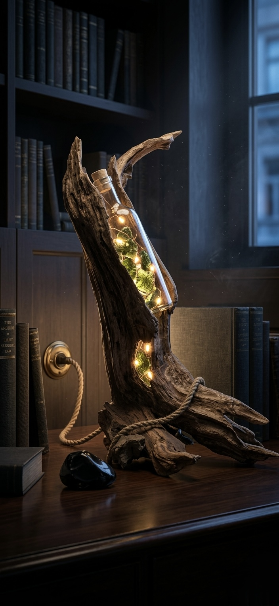
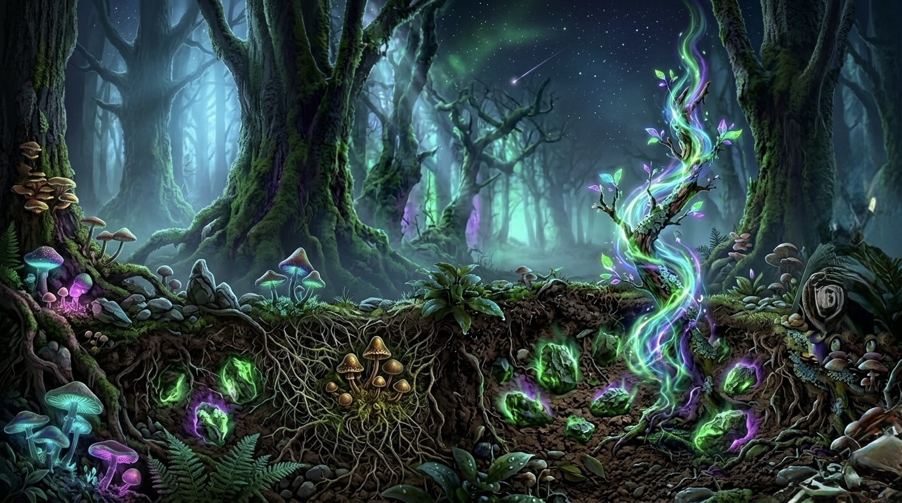
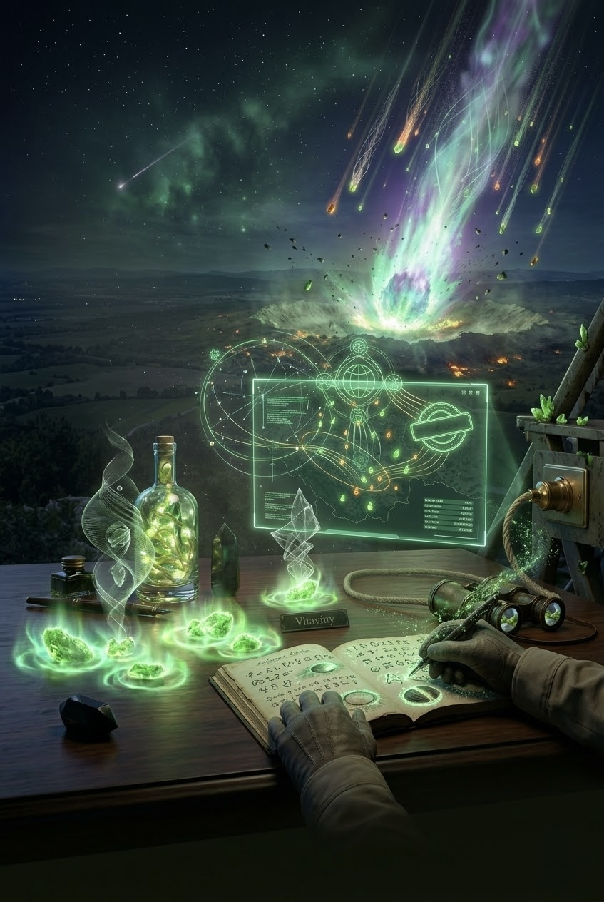
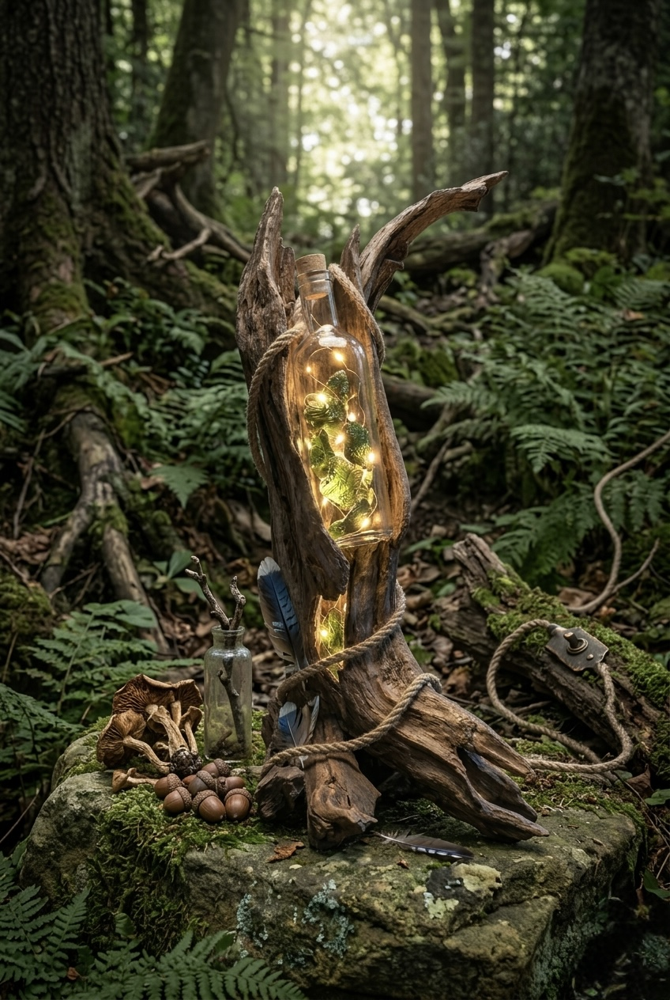
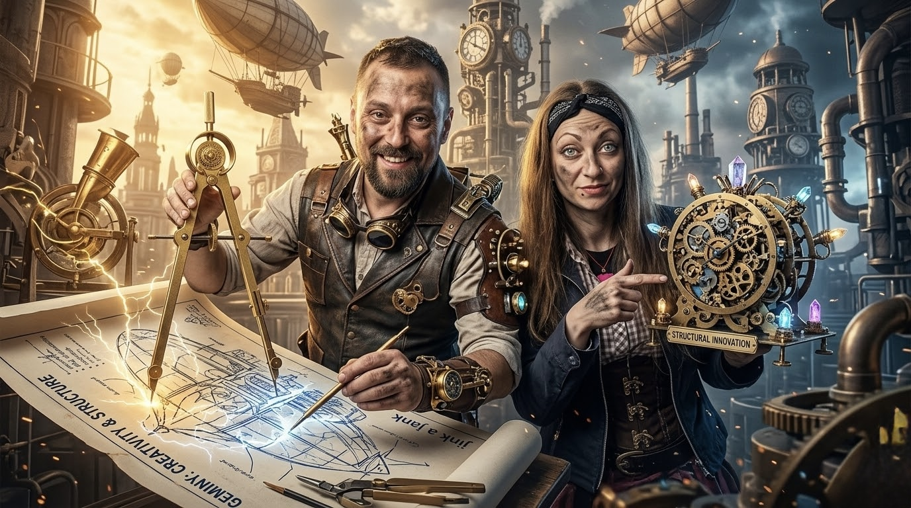
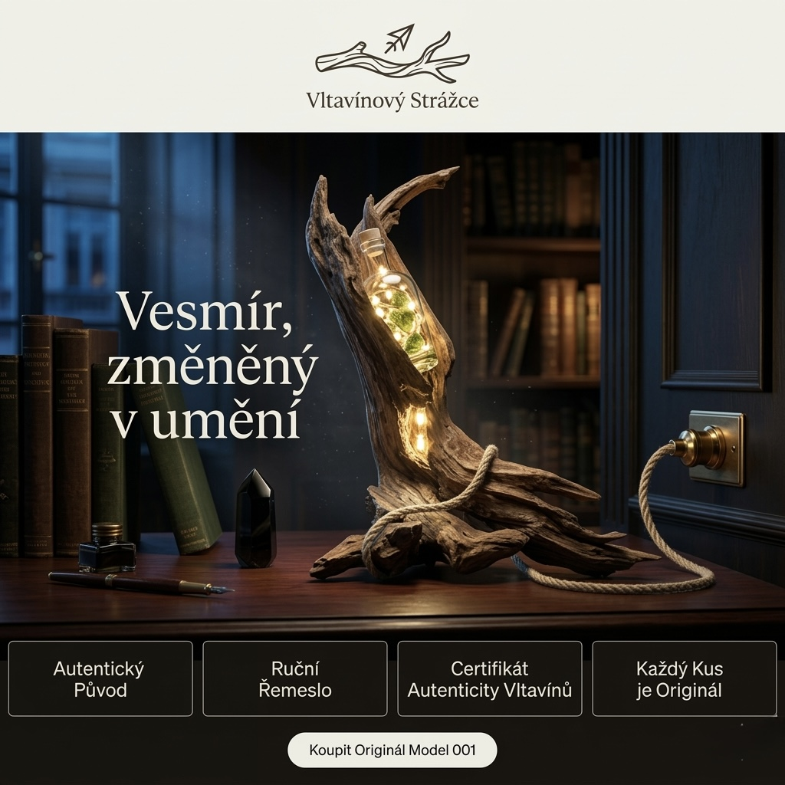
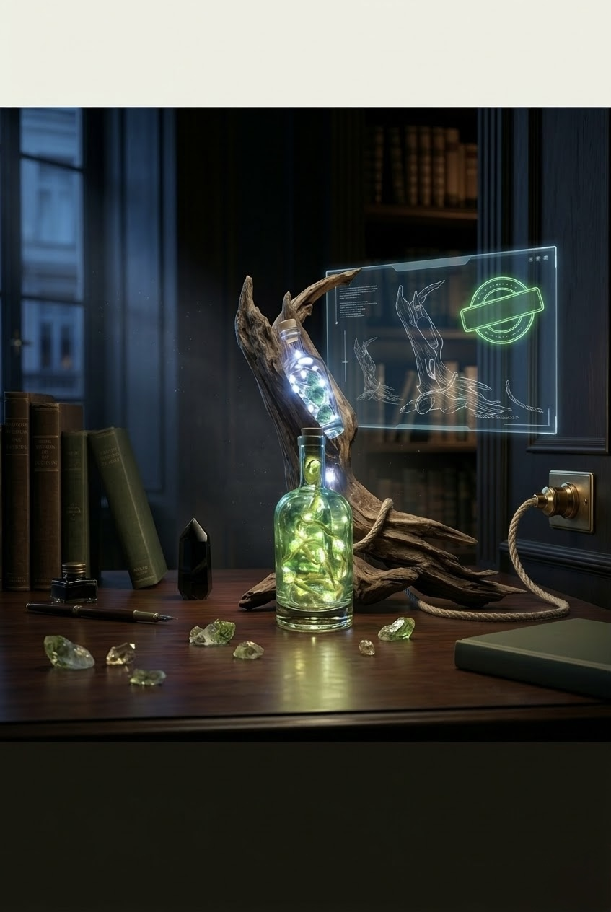

# 🛠️ Agent Strategie: Vltavínový Strážce — Web Build & Deploy

> **Účel:** Step-by-step zadání pro kodovacího agenta. Agent podle tohoto dokumentu nakóduje kompletní web a provede deploy na Vercel.
> **Cílová doména:** https://vltavinovy-ztrazce.vercel.app/

---

## 📋 Přehled projektu

**Vltavínový Strážce** je umělecko-technický projekt — ručně vyrobená lampička z naplaveného dřeva a kosmických vltavínů. Web je Single Page Application (SPA) v čistém HTML, CSS a JavaScriptu. Žádný framework, žádný build step, žádný npm.

### Klíčové soubory v repozitáři

| Soubor | Účel |
|--------|------|
| `reference/vstupni_index.html` | **Referenční šablona** — základ pro finální `index.html`. Obsahuje veškeré CSS, JS, layout a logiku. Placeholder obrázky a prázdný API klíč. |
| `graficky_klic.md` | **Hlavní navigační dokument** — katalog 17 obrázků, přesné mapování na sekce, doporučené animace, layout, CSS efekty. |
| `texts/Text_1_Vltavin_a_Zem.md` | Esej o původu materiálů (vltavíny, dřevo) |
| `texts/Text_2_Matejuv_Pribeh.md` | Osobní manifest — vyhoření, fakta vs. pravda |
| `texts/Text_3_Barin_Pribeh.md` | Umělecký přínos Báry |
| `texts/Text_4_Synergie_Produkt.md` | Popis artefaktu a synergie |
| `texts/Text_5_Technicke_Detaily.md` | Technický deník — materiály, elektrika, výroba |
| `texts/Text_6_Rozsirene_Narativy.md` | Rozšířené narativy, micro-copy, citáty pro všechny sekce |
| `images/` | 17 unikátních AI-vizualizací (JPEG) |

---

## 🚀 KROKY PRO AGENTA (Step-by-Step)

---

### KROK 1: Vytvořit `index.html` v kořeni repozitáře

Zkopírovat obsah `reference/vstupni_index.html` do nového souboru `index.html` v kořeni repozitáře. Toto bude finální produkční soubor.

**Proč kořen:** Vercel automaticky servíruje `index.html` z kořene.

---

### KROK 2: Nahradit placeholder cesty k obrázkům

V referenčním HTML jsou cesty ve formátu `uploaded:Vltavinova větev lampička/IMG_XXXX.jpg` a `uploaded:image.png-...`. Tyto nahradit skutečnými cestami z `images/` podle mapování v `graficky_klic.md`.

#### Přesné mapování (Hero slideshow):

```html
<!-- HERO SLIDESHOW — 4 obrázky v pořadí -->




```

#### Kapitola I — Původ (`#puvod`):
```html
<!-- Split-image (pravá strana) -->

```

#### Kapitola II — Filozofie (`#filozofie`):
```html
<!-- Split-image (levá strana, reverse layout) -->

```

#### Kapitola III — Tvůrci (`#tvurci`):
```html
<!-- Split-image (levá strana) -->

```

#### Kapitola IV — Oracle (`#oracle`):
```html
<!-- Pozadí sekce -->

```

#### Kapitola V — Artefakt (`#artefakt`):
```html
<!-- Produktový záběr nad formulářem -->


<!-- Pozadí kontaktního boxu (subtle) -->

```

---

### KROK 3: Rozšířit textový obsah podle zdrojových textů

Integrovat bohatší texty z `texts/` souborů a `Text_6_Rozsirene_Narativy.md`. Zachovat stávající strukturu (drop-cap, quote-block, split sekce), ale obohatit:

#### Kapitola I (`#puvod`) — přidat:
- **Factoid blok** (data-card) vedle obrázku:
  ```
  ⚡ Rychlost nárazu meteoritu: ~50 000 km/h
  🌡️ Teplota při tavení hornin: 1 600–2 000 °C
  🕰️ Stáří vltavínu: 14 800 000 let
  📍 Oblast nálezu: Jižní Čechy, jižní Morava
  🔬 Složení: SiO₂ 96 % — přírodní sklo
  ```
- Doplňující odstavec z `Text_6_Rozsirene_Narativy.md` (paragraf o paradoxu vltavínu)

#### Kapitola II (`#filozofie`) — přidat:
- Nový úvodní odstavec z Text_6 (o okamžiku, kdy přestanete slyšet)
- Alternativní citát do quote-block z Text_6
- Závěrečný odstavec sekce z Text_6 (o záchranné brzdě)

#### Kapitola III (`#tvurci`) — přidat:
- **Bářin medailonek** z Text_6 (pod portrét)
- **Matějův medailonek** z Text_6
- Podsekci **„Za scénou: Jak se rodí Strážce"** s galerií 2–3 fotografií:
  - `images/lampicka_tvorba_kancelar.jpg` — *caption z Text_6*
  - `images/matej_bara_tvorba_lampicky2.jpg` — *caption z Text_6*
  - `images/vizualizace_matej_bara_tvori_lampicka.jpg` — *caption z Text_6*
  
  Layout: CSS grid `1fr 1fr` (nebo `1fr 1fr 1fr` pro 3 fotky), max-width 900px, centrováno.

#### Oracle (`#oracle`) — přidat:
- Mystickou předmluvu z Text_6 (nad stávajícím oracle boxem)
- Změnit placeholder textarea: *„Popište svůj náraz. Strážce odpovídá pravdou bez filtru."*

#### Artefakt (`#artefakt`) — přidat:
- Úvodní odstavec z Text_6 (nad stávajícím textem)
- **Specifikace produktu** (data-list/tabulka vedle formuláře):
  ```
  Materiál:     Autentický naplaveník + přírodní vltavíny
  Světlo:       LED 4000K, CRI 90+, 12V DC
  Kabel:        1,8 m, konopný oplet
  Rozměry:      ~40 × 12 × 8 cm (každý kus unikátní)
  Váha:         600–800 g
  Série:        Limitovaná — Model 001 (max. 12 kusů)
  Certifikace:  Průvodní list + podpis tvůrců
  ```
- Závěrečná věta z Text_6 nad CTA

#### Footer — přidat:
- Navigační drobečky: `Původ kamene | Matějův příběh | Bářina vize | Artefakt | Poselství`

---

### KROK 4: Implementovat rozšířené CSS animace z grafického klíče

Do `<style>` bloku přidat (pokud chybí):

#### a) Rozšířený Scroll Reveal:
```css
.reveal-left { opacity: 0; transform: translateX(-80px); transition: all 1.2s cubic-bezier(0.2, 0.8, 0.2, 1); }
.reveal-right { opacity: 0; transform: translateX(80px); transition: all 1.2s cubic-bezier(0.2, 0.8, 0.2, 1); }
.reveal-scale { opacity: 0; transform: scale(0.95); transition: all 1.4s cubic-bezier(0.2, 0.8, 0.2, 1); }
.reveal-left.active, .reveal-right.active, .reveal-scale.active { opacity: 1; transform: translateX(0) scale(1); }
```

#### b) Vylepšený Ken Burns:
```css
@keyframes heroSlideshow {
    0%   { opacity: 0; transform: scale(1.08); }
    8%   { opacity: 1; transform: scale(1.05); }
    25%  { opacity: 1; transform: scale(1.02); }
    33%  { opacity: 0; transform: scale(1.00); }
    100% { opacity: 0; transform: scale(1.08); }
}
```

#### c) Hover glow na dramatic-photo:
```css
.dramatic-photo:hover, .portrait-photo:hover {
    filter: grayscale(10%) contrast(110%) brightness(85%) sepia(0%);
    transform: scale(1.03);
    box-shadow: 0 0 40px rgba(203, 161, 53, 0.2);
}
```

#### d) Lazy loading na všechny obrázky mimo hero:
```html

```
Hero slideshow obrázky: `loading="eager"`.

#### e) Parallax na hero:
Do JS přidat:
```javascript
window.addEventListener('scroll', () => {
    document.documentElement.style.setProperty('--scroll-y', window.scrollY);
});
```
A CSS:
```css
.slideshow-image {
    transform: translateY(calc(var(--scroll-y, 0) * 0.3px));
    will-change: transform;
}
```

#### f) Rozšířit IntersectionObserver o nové reveal třídy:
```javascript
const revealElements = document.querySelectorAll('.reveal, .reveal-left, .reveal-right, .reveal-scale');
```

---

### KROK 5: Přidat navigační tooltipy

Do nav linků přidat atributy `title`:
```html
<a onclick="showPage('puvod')" id="link-puvod" title="Kapitola I — Fyzický náraz">Náraz</a>
<a onclick="showPage('filozofie')" id="link-filozofie" title="Kapitola II — Fakta, která dýchají">Pravda</a>
<a onclick="showPage('tvurci')" id="link-tvurci" title="Kapitola III — Tvůrci">Duše</a>
<a onclick="showPage('oracle')" id="link-oracle" title="AI Oracle — Strážce naslouchá" style="color: var(--hope-gold);">✨ Poselství</a>
<a onclick="showPage('artefakt')" id="link-artefakt" title="Epilog — Získat Strážce">Artefakt</a>
```

---

### KROK 6: Ponechat Gemini API klíč prázdný

V proměnné `const apiKey = "";` ponechat prázdný řetězec. AI Oracle je navržen tak, aby bez klíče zobrazil fallback odpověď: *„Hvězdy nyní mlčí…"*

Funkčnost Oracle bude aktivována později vlastníkem vložením vlastního Google Gemini API klíče.

---

### KROK 7: Vytvořit `vercel.json` pro deployment

Vytvořit v kořeni repozitáře soubor `vercel.json`:

```json
{
  "version": 2,
  "builds": [
    {
      "src": "index.html",
      "use": "@vercel/static"
    },
    {
      "src": "images/**",
      "use": "@vercel/static"
    }
  ],
  "routes": [
    {
      "src": "/(.*)",
      "dest": "/$1"
    }
  ]
}
```

---

### KROK 8: Deploy na Vercel (CLI)

Vercel projekt již existuje. Použít Vercel CLI pro deployment:

```bash
# 1. Instalace Vercel CLI (pokud chybí)
npm install -g vercel

# 2. Přihlášení pomocí tokenu
export VERCEL_TOKEN="vck_6TOugD0kSAWbMqhSQWl2wKkB4eM04Rg6r2QBorsZL55ujRE5WD1CPZD6"

# 3. Production deploy na existující Vercel projekt
vercel deploy --prod --token=$VERCEL_TOKEN --yes \
  --scope meveriks-projects \
  --name vltavinovy-ztrazce
```

**Vercel Project ID:** `prj_qXGq5T7XQWDU6OVzJQckNguZG77u`
**Cílová URL:** https://vltavinovy-ztrazce.vercel.app/

Pokud deploy selže na scope, zkusit alternativně:
```bash
vercel link --project prj_qXGq5T7XQWDU6OVzJQckNguZG77u --token=$VERCEL_TOKEN --yes
vercel deploy --prod --token=$VERCEL_TOKEN --yes
```

---

### KROK 9: Ověřit deploy

Po úspěšném deployi:
1. Otevřít https://vltavinovy-ztrazce.vercel.app/ a ověřit:
   - Hero slideshow se správnými obrázky
   - Navigace mezi sekcemi (SPA)
   - Scroll reveal animace
   - Canvas stardust efekt
   - Všechny obrázky se načítají správně
   - Responzivní zobrazení (mobilní breakpoint < 960px)
   - Oracle sekce zobrazuje fallback bez API klíče
2. Zkontrolovat konzoli prohlížeče na chyby (žádné 404 na obrázky)

---

### KROK 10: Odstranit API klíč z README.md

**KRITICKÝ BEZPEČNOSTNÍ KROK — provést ihned po úspěšném deployi.**

V souboru `README.md` nahradit celý blok obsahující Vercel credentials:

**Odebrat tento text z README.md:**
```
Id projektu na Vercel: prj_qXGq5T7XQWDU6OVzJQckNguZG77u
API klíč pro Vercel: vck_6TOugD0kSAWbMqhSQWl2wKkB4eM04Rg6r2QBorsZL55ujRE5WD1CPZD6 (po přečtení zneviditelnit)
```

**Nahradit za:**
```
Id projektu na Vercel: prj_qXGq5T7XQWDU6OVzJQckNguZG77u
API klíč pro Vercel: [ODSTRANĚN — uložen v zabezpečeném úložišti]
```

Poté commitnout a pushnout, aby klíč zmizel z aktuálního stavu repozitáře.

> ⚠️ **Poznámka:** Klíč zůstane v Git historii. Po deployi zvažte jeho invalidaci/rotaci v Vercel Dashboard.

---

### KROK 11: Commit a push

```bash
git add index.html vercel.json README.md
git commit -m "feat: finální web Vltavínový Strážce + deploy na Vercel

- Vytvořen index.html z referenční šablony
- Nahrazeny placeholder obrázky skutečnými cestami (images/)
- Rozšířen textový obsah ze zdrojových souborů
- Implementovány pokročilé CSS animace (Ken Burns, reveal, parallax)
- Přidán vercel.json pro statický hosting
- BEZPEČNOST: odstraněn Vercel API klíč z README"

git push origin main
```

---

## ⚠️ Bezpečnostní poznámky pro agenta

1. **Vercel API token je jednorázový pro deploy.** Po KROK 10 z README zmizí. V kódu se NESMÍ objevit.
2. **Gemini API klíč nechat prázdný.** Nepoužívat žádný hardcoded klíč v kódu.
3. **Formulář v sekci Artefakt** je momentálně jen `alert()`. Nepřidávat žádný backend endpoint.
4. **Nepřidávat žádné trackovací skripty** (Google Analytics, Facebook Pixel).
5. **Cesty k obrázkům** musí být relativní (`images/soubor.jpg`), ne absolutní.

---

## ✅ Kontrolní seznam implementace

- [ ] `index.html` vytvořen v kořeni repozitáře
- [ ] Všechny `uploaded:...` cesty nahrazeny za `images/...`
- [ ] Hero slideshow: 4 správné obrázky s alt texty
- [ ] Kapitola I: obrázek + factoid blok
- [ ] Kapitola II: obrázek + rozšířené texty
- [ ] Kapitola III: portrét tvůrců + galerie tvorby (2–3 fotky)
- [ ] Oracle: pozadí + mystická předmluva
- [ ] Artefakt: produktový shot + specifikace + kontaktní formulář
- [ ] CSS animace: reveal-left, reveal-right, reveal-scale, Ken Burns, parallax
- [ ] Lazy loading na obrázky (mimo hero)
- [ ] Navigační tooltipy
- [ ] `vercel.json` vytvořen
- [ ] Deploy na Vercel úspěšný
- [ ] Web dostupný na https://vltavinovy-ztrazce.vercel.app/
- [ ] API klíč odstraněn z README.md
- [ ] Git commit + push

---

*Dokument vygenerován: 16. března 2026 | MEVERIK STUDIO®*
